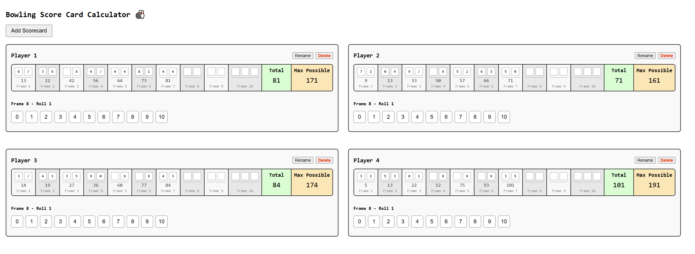

# Bowling Score Calculator

An interactive web app for keeping track of bowling scores for up to 6 players. Built with React (frontend) and Node.js/Express (backend), this project demonstrates a dynamic state management and real-time bowling score calculation—including official scoring rules for strikes and spares.

## Features
* Multi-player: Track up to 6 players’ scores simultaneously.
* Intuitive UI: Enter rolls by clicking pin buttons—no typing required.
* Official scoring: Handles strikes, spares, and 10th-frame rules just like a real bowling alley.
* Live totals: See running and per-frame scores as you play.
* Max possible: Shows the maximum possible score you can still achieve.
* Rename & delete: Rename scorecards or remove them at any time.
* Dynamic: Players can fill out their scorecards in any order.

## Preview



## Getting Started
Prerequisites
* [Node.js](https://nodejs.org/en) (v16 or newer recommended)
* [npm](https://www.npmjs.com/) (comes with Node.js)

Once you have finished downloading Node.js and if you have a computer running on Windows, search for the **Node.js command prompt** throught the Windows menu.
Open two of these command prompts, where one of them will be utilized for the backend and the other for the frontend.

### Installation

1. Clone the repository:
   Before cloning the repository, make sure you navigate to a directory you want to clone the repo to using the `cd` command.
   Once you have decided upon a directory, clone this repo using the command below.
   ```
   git clone https://github.com/NikoP1k0/Bowling-Score-Calculator.git
   ```

   Once you have cloned the repo, navigate into the project files by using the command below.
   ```
   cd Bowling-Score-Calculator
   ```

3. Install backend dependencies:
   Now that you are inside the project files, navigate to the backend by running the commands below.
   ```
   cd backend
   ```

   Now that you have navigated to the backend files, install the backend dependencies by running the following command.
   ```
   npm install
   ```
   
5. Install frontend dependencies:
   Now that you have installed the dependencies for the backend you can leave the backend command prompt for now and move to your second one.
   Navigate to the ``Bowling-Score-Calculator`` in the same way you have done when setting up the backend.

   Once you have found the project files, navigate into the frontend files using the command below.
   ```
   cd frontend
   ```

   Now use the following command to install the frontend dependencies.
   ```
   npm install
   ```
   
### Running the App
Now that you have properly set up your frontend and backend, the next step is to run the app.

1. Start the backend:
   Go back to your command prompt handling your backend and if you're not in the ``backend`` directory, navigate to it using ``cd`` and run the following command.
   ```
   npm start
   ```

   Once you have done this, the following message or something similar should appear:
   ```
   > backend@1.0.0 start
   > node index.js

   Bowling backend running on port 3001
   ```
   This means that your backend is running properly and you can leave this command prompt alone. 
   The backend will run on [http://localhost:3001](http://localhost:3001).

3. Start the frontend:
   Go back to your command prompt handling your frontend and if you're not in the ``frontend`` directory, navigate to it using ``cd`` and run the same command you used for the backend.
   ```
   npm start
   ```

   Once you have done this, the following message or something similar should appear along with other longer messages:
   ```
   > frontend@1.0.0 start
   > react-scripts start
   ```

   Your frontend should be running now and the application will open automatically in your browser.
   The frontend will run on [http://localhost:3000](http://localhost:3000).

   **Note 1:** The frontend expects the backend to be running on port 3001.
   **Note 2:** If you want to stop running the application, just close down the command prompts.
   

#### Technologies Used
* **Frontend:** React, JavaScript, CSS
* **Backend:** Node.js, Express
